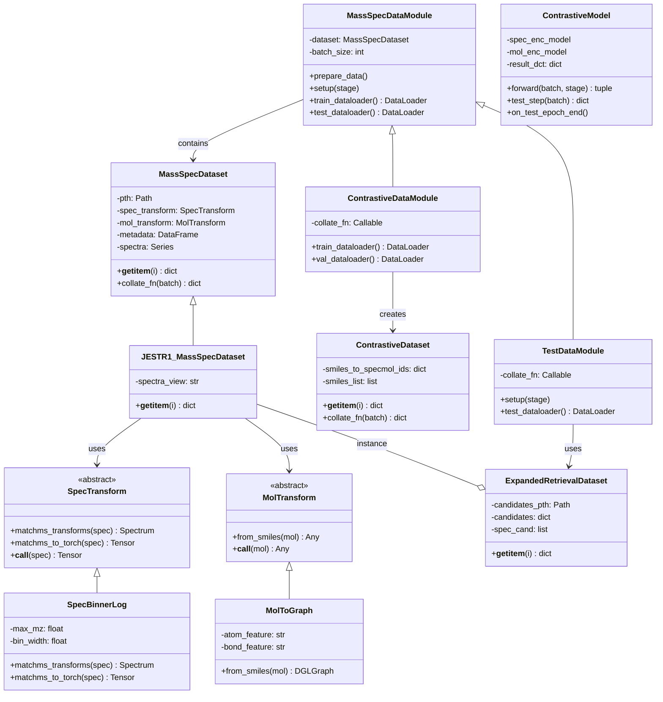

# JESTR1 Data Flow - Mermaid Diagrams

## Class Diagram

```mermaid
classDiagram
    direction TB

    %% Transforms
    class SpecTransform {
        <<abstract>>
        +matchms_transforms(spec) Spectrum
        +matchms_to_torch(spec) Tensor
        +__call__(spec) Tensor
    }

    class SpecBinnerLog {
        -max_mz: float
        -bin_width: float
        +matchms_transforms(spec) Spectrum
        +matchms_to_torch(spec) Tensor
    }

    class MolTransform {
        <<abstract>>
        +from_smiles(mol) Any
        +__call__(mol) Any
    }

    class MolToGraph {
        -atom_feature: str
        -bond_feature: str
        +from_smiles(mol) DGLGraph
    }

    SpecTransform <|-- SpecBinnerLog
    MolTransform <|-- MolToGraph

    %% Datasets
    class MassSpecDataset {
        -pth: Path
        -spec_transform: SpecTransform
        -mol_transform: MolTransform
        -metadata: DataFrame
        -spectra: Series
        +__getitem__(i) dict
        +collate_fn(batch) dict
    }

    class JESTR1_MassSpecDataset {
        -spectra_view: str
        +__getitem__(i) dict
    }

    class ExpandedRetrievalDataset {
        -candidates_pth: Path
        -candidates: dict
        -spec_cand: list
        +__getitem__(i) dict
    }

    class ContrastiveDataset {
        -smiles_to_specmol_ids: dict
        -smiles_list: list
        +__getitem__(i) dict
        +collate_fn(batch) dict
    }

    MassSpecDataset <|-- JESTR1_MassSpecDataset
    JESTR1_MassSpecDataset --o ExpandedRetrievalDataset : instance

    %% DataModules
    class MassSpecDataModule {
        -dataset: MassSpecDataset
        -batch_size: int
        +prepare_data()
        +setup(stage)
        +train_dataloader() DataLoader
        +test_dataloader() DataLoader
    }

    class TestDataModule {
        -collate_fn: Callable
        +setup(stage)
        +test_dataloader() DataLoader
    }

    class ContrastiveDataModule {
        -collate_fn: Callable
        +train_dataloader() DataLoader
        +val_dataloader() DataLoader
    }

    MassSpecDataModule <|-- TestDataModule
    MassSpecDataModule <|-- ContrastiveDataModule

    %% Models
    class ContrastiveModel {
        -spec_enc_model
        -mol_enc_model
        -result_dct: dict
        +forward(batch, stage) tuple
        +test_step(batch) dict
        +on_test_epoch_end()
    }

    %% Relationships
    MassSpecDataModule --> MassSpecDataset : contains
    TestDataModule --> ExpandedRetrievalDataset : uses
    ContrastiveDataModule --> ContrastiveDataset : creates
    JESTR1_MassSpecDataset --> SpecTransform : uses
    JESTR1_MassSpecDataset --> MolTransform : uses
```
